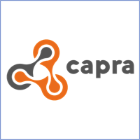


    

Join us for our next Open Research Webinars on Tuesday, September 28, 2021 at 16:00 CET. 

Through a selection of state-of-the-art project presentations and demonstrations, this new series of webinars introduces software research projects that help shape the future of open source software and the IT industry. Co-organized by OW2 and the Eclipse Foundation, the webinars will focus on international partners leveraging open source in European publicly-funded collaborative research and innovation programs.

### Presentations   
 

   



  



  





